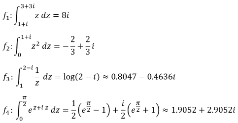

# Exam project in Numerical Methods

## Project 20: Adaptive integration of complex-valued functions

> Implement an adaptive integrator which calculates the integral of a complex-valued function `f(z)` of a complex variable `z` along a straight line between two points in the complex plane.

The solution in this exam project used an adaptive method with closed quadratures. It recursively iterates until the defined tolerance is met. The interface to the integration function `adapt()` is:

```c++
complex<double> adapt(function<complex<double>(complex<double>)> f, 
                      complex<double> a, 
                      complex<double> b, 
                      double acc, 
                      double eps);
```
which takes a complex-valued function `f(z)`, complex integration limits `a` and `b` and absolute and relative accuracies `acc` and `eps`. It returns the complex result of the integration.

To demonstrate that the function works, four different functions are evalutated with different limits:



The results can be found in [outA.txt](outA.txt).
